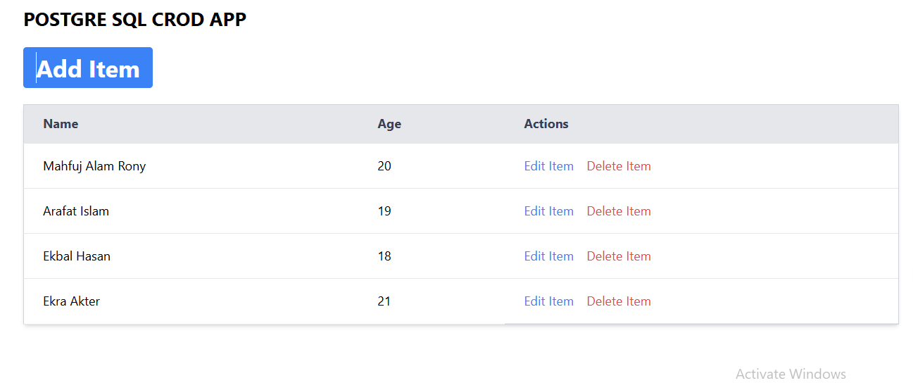

# PostgreSQL CRUD Application

A simple **CRUD (Create, Read, Update, Delete)** application built using modern web technologies. This app demonstrates the use of a RESTful API for handling backend operations and a responsive frontend interface for user interaction.

---

## 🚀 Live Preview
[View Live Application](https://postgre-sql-crud.vercel.app/)

---

## 📸 Screenshot


---

## 🛠️ Technologies Used
### **Frontend**
- **React.js**: For building a responsive and dynamic user interface.
- **Tailwind CSS**: For modern and customizable styling.

### **Backend**
- **Node.js**: For server-side operations.
- **Express.js**: For creating RESTful APIs.

### **Database**
- **PostgreSQL**: For storing and managing data using **Neon** as a managed database provider.

---

## 📂 Project Structure
```plaintext
├── my-project/       # Frontend folder
│   ├── public/
│   ├── src/
│   │   ├── components/
│   │   ├── utils/
│   │   ├── App.js
│   │   ├── index.js
├── server/           # Backend folder
│   ├── routes/
│   │   ├── api.js    # API routes
│   ├── index.js      # Entry point for the server
│   ├── package.json  # Backend dependencies
